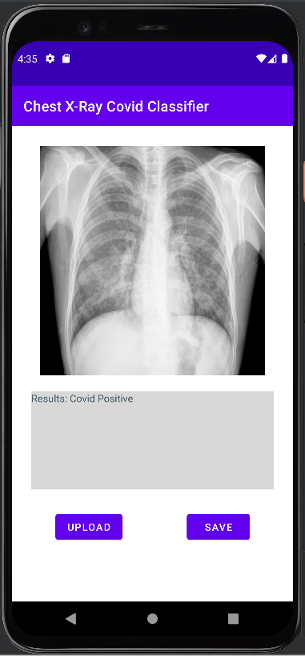

SDK version: Android 12.0 (S)
 
Requires tensorflow lite and firebase libraries
 
Author: Stuart Harley

App is my final project for Mobile App Development. Upload a chest xray and the app will run a tensorflow lite model to detect covid-19. Images can be saved to firebase storage. Firebase analytics and crashlytics are also enabled.

